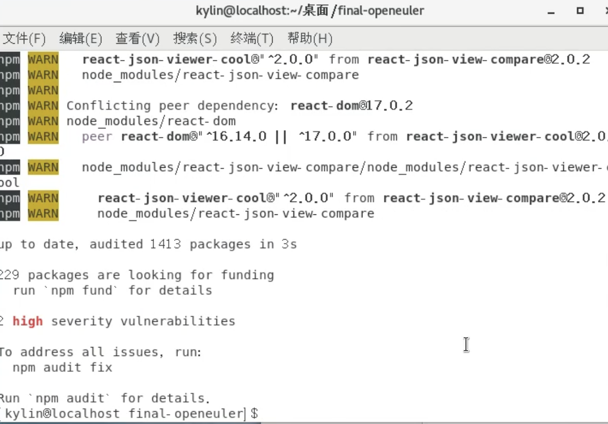
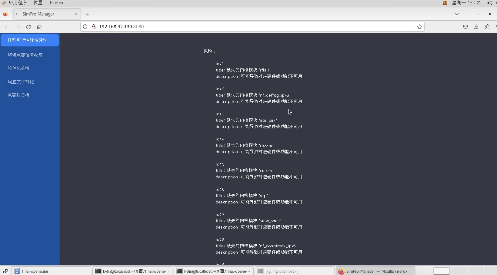
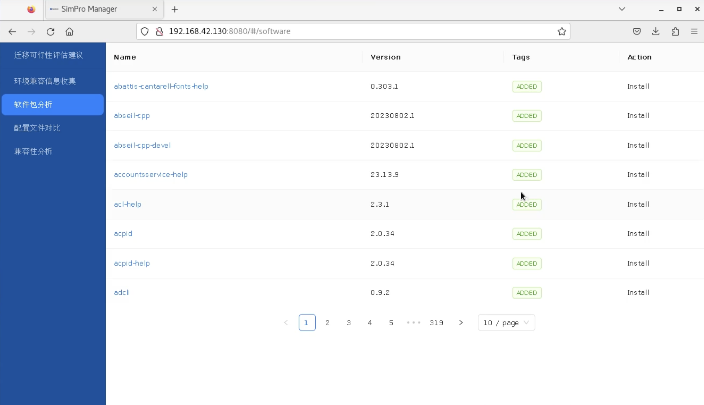

# EulerAssessor

本项目旨在为从 CentOS 等发行版迁移至 openEuler 提供系统兼容性与迁移深度评估，功能包括：

- **环境信息收集**（源系统 & 目标系统）  
- **配置文件差异**、**硬件/驱动差异**、**命令可用性**等深度对比  
- **软件包差异分析**（增删改 & 依赖变化 & 文件变化）
- **演示视频** https://www.bilibili.com/video/BV1myw9e8EH6

---
## 前端技术栈

Webpack 5 + Typescript + React + @fluentui

---

## 文件目录说明

- **EulerAssessor**
  - 包含了后端所有代码，单个的采集逻辑，以及serve.py的flask api代码。

  - **collect_and_compare_all.py**  
    - 用于一次性收集源系统/目标系统信息，并做对比生成差异结果。  
    - 提供 3 个命令模式：  
      1. `source` — 收集源系统信息，输出 `source_all.json`  
      2. `target` — 收集目标系统(ISO)信息，输出 `target_all.json`  
      3. `compare` — 对比上面两份 JSON，生成 `all_diff.json`
    - ⭐️新增：通过rpmcpio，配合原有的rpm -qpl，同步深度整合iso中的信息并进一步解包，
    实现更加完整的信息采集。
    - ⭐️新增: 对.ko文件用modinfo解包深度内容，收集到了相关的设备驱动信息，呈现在前端。
  - **difference.py**  
    - 用于分析软件包差异（对比 `sourceinfo.json` 与 `targetinfo.json`），输出 `package_differences.json`。  
    - 主要识别：新增包、删除包、更新包、依赖变动、文件差异等。

  - **rpminfo_collector.py**  
    - 用于收集系统或 ISO 上的 RPM 包信息（依赖、版本、文件列表），生成 `sourceinfo.json` / `targetinfo.json`。  
    - 与 `difference.py` 配合使用可得到详细的软件包差异分析。

  - **systeminfo_collector.py**  
    - 用于收集系统的 CPU、内存、磁盘、网络、驱动、进程、服务等信息，输出 `system_info.json`。

  - **serve.py**  
    - Flask 后端示例文件，用于将上述采集、对比功能封装成 REST API 供前端调用。

- **根目录**
  - 主要包含了React编写的前端的代码

- **sample_json**
  - 包含了为了免等待，测试前端效果的，在比赛方提供的CentOS7系统中采集到的**真实**信息的原系统和目标系统的各项参数的json文件。
---

## 环境依赖

1. **操作系统**：CentOS7（比赛官方提供的镜像，root密码是Euler123@）  
2. **Python 3**：Python 3.9
3. **前端套件版本**：npm@8.19.4，node@v16.20.2
3. **必需工具**：  
   - `rpm` 命令（CentOS 默认自带），用于包查询与解包信息获取。  
   - 挂载相关命令（如 `mount`、`umount`）；须确保具备 `sudo` 权限（若脚本中调用相关操作）。  

---

## 使用步骤 (只想快速获取json文件的运行方式，即不运行前端)

请确保已经将 openEuler 的 ISO 文件挂载到 `/mnt/iso` 路径（其中的 `Packages/` 存放于 `/mnt/iso/Packages`）。

### 1. 采集源系统信息

```bash
python3.9 collect_and_compare_all.py source
```
### 2. 采集目标系统信息 (ISO 静态扫描)
```bash
python3.9 collect_and_compare_all.py target
```
### 3. 对比源/目标系统信息
```bash
python3.9 collect_and_compare_all.py compare
```
默认对比 source_all.json 与 target_all.json，生成 all_diff.json。
all_diff.json 包含三个主要段落：
config_diff — 配置文件在目标系统是否缺失、是否找到对应 RPM。
hardware_diff — 硬件/驱动差异（源系统已加载的模块 vs. 目标系统可用 .ko）。
command_diff — 命令可用性（哪些命令源系统有、目标系统缺失，或已匹配）。

### 4. 软件包差异分析
若想分析包增删改、依赖库变化、文件变动等，可先用 rpminfo_collector.py分别生成 sourceinfo.json 与 targetinfo.json：
```bash
python3.9 rpminfo_collector.py
```
然后执行
```bash
python3.9 difference.py
```
脚本默认会对比 sourceinfo.json 与 targetinfo.json 并输出 package_differences.json，包含：
added_packages
removed_packages
updated_packages
dependency_differences
file_differences

## ✅包含前端的完整运行方式

## 1.开启后端
确保已安装python flask api套件包，在Euler Assessor文件夹下，执行命令：
```bash
python3.9 serve.py
```
**实际上这一步执行的逻辑和不带前端的使用步骤相同，只不过如果一开始就运行serve.py，采集速度可能会很慢，导致前端不能及时显示内容，所以一般情况下还是先通过第一步获取好json，再执行本步骤，感官体验会更好**

## 2.开启前端
直接在根目录文件夹下，执行如下命令：
```bash
npm install
```
等待依赖安装好（但是由于我上传的版本是已经install好依赖的，所以这一步应该会很快）


然后拉起前端：
```bash
npm run start
```

这样就能看到前端的页面了：



其他侧边栏的功能，演示视频中已有详细的描述，辛苦查看一下演示视频。
## PS! ⚠️
由于考虑到执行情况，我这边上传了完整的json文件，保存在根目录下的sample_json文件夹下，如果不想等待太长时间，想快速验证前端效果，可以吧这个文件夹下的json文件拖到EulerAssessor文件夹下即可。